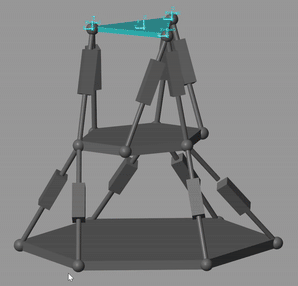
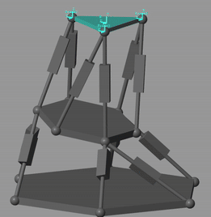

# Stewart平台Simulink仿真 🚀

## 📌 项目简介
本项目实现了**双层Stewart平台**的Simulink仿真系统：

- **底层平台**：模拟船舶甲板倾斜扰动（6自由度）
- **上层平台**：在未知底层运动状态下实现实时位姿补偿

### 工作模式对比
| 模式 | 特点                   | 效果展示                                                                      |
|------|----------------------|---------------------------------------------------------------------------|
| **静态补偿**<br>固定位姿 | • 保持静态位姿<br>• 抗扰动补偿  |   |
| **动态补偿**<br>轨迹跟踪 | • 跟随动态轨迹<br>• 实时态补偿  |  |

## 🖥️ 系统要求

### 必需组件
```matlab
% 在MATLAB中验证安装：
>> ver('Simulink')            % 核心仿真环境
>> license('test','Simscape')  % 多体动力学仿真
% 推荐工具箱验证：
>> license('test','Control_Toolbox')    % 高级控制算法
>> license('test','Simulink_3D_Animation') % 三维可视化